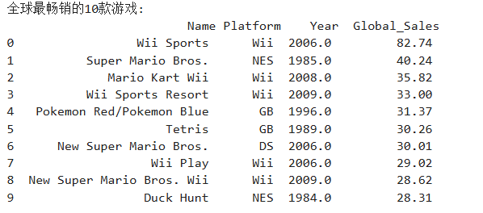
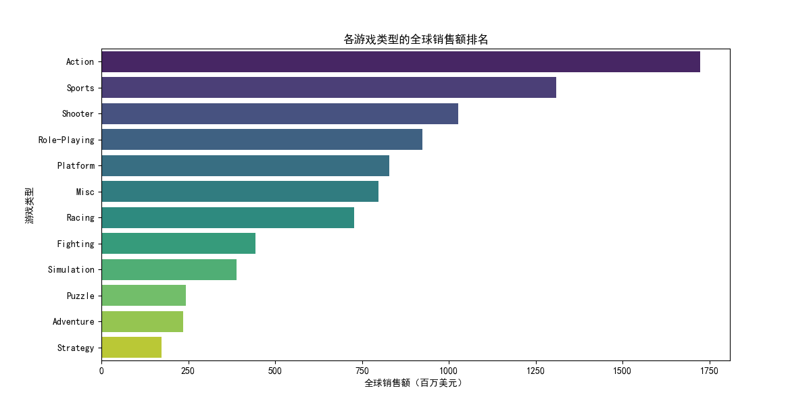
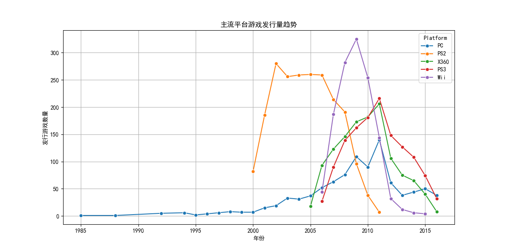
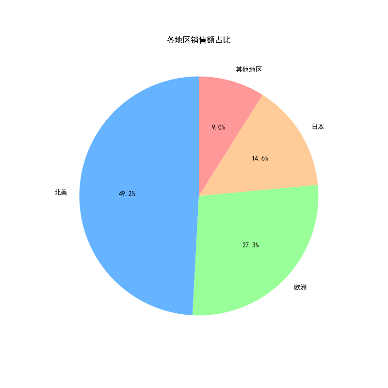

# 🎮 全球电子游戏销售分析  
**基于16,598条游戏销售数据的市场洞察 | Python/SQL/Tableau**  
 

---

## 📌 项目概述  
**目标**：分析全球电子游戏销售数据，挖掘畅销游戏特征、市场分布规律与行业趋势，为游戏开发与发行策略提供数据支持。  
**关键成果**：  
- 识别动作类（Action）和体育类（Sports）为最畅销游戏类型，合计占比超30%；  
- 发现北美市场贡献近50%销售额，日本市场RPG类占比35%；  
- 揭示任天堂（Nintendo）为市场份额最高发行商（占比17%）。  

---

## 🛠️ 技术栈  
- **数据分析**：Python (Pandas, Matplotlib, Seaborn)  
- **数据查询**：SQL (分组聚合、多条件筛选)  
- **可视化**：Plotly, Tableau  

---

## 📂 数据来源  
Kaggle公开数据集：[Video Game Sales](https://www.kaggle.com/gregorut/videogamesales)  
- **数据量**：16,598条记录，11个字段  
- **关键字段**：  
  - `Global_Sales`（全球销售额）  
  - `Genre`（游戏类型）  
  - `Platform`（发行平台）  
  - `Publisher`（发行商）  

---

## 🔍 分析流程  

---

## 1 数据清洗
 - 处理缺失值：删除年份缺失的记录
 - 2017年和2020年数据过少，选择删除处理。
 - 确保年份为整数

---

## 2 数据分析
 ### 全球最畅销游戏TOP10
 

 ### 各游戏类型销售额排名

  
   
  <em>动作类和体育类游戏销售额占比最高</em>

 ### 主流平台游戏发行量趋势

  
   
  <em>PS2在2000-2006年占据主导地位，PC平台呈现稳定增长。</em>

### 各地区销售额占比

  
   
  <em>北美市场占比48.7%，日本市场RPG类占比35%</em>

---

## 💡 业务建议

 
| 问题               | 策略                     | 预期效果           |
|--------------------|--------------------------|--------------------|
| 类型集中度高       | 拓展动作/体育类细分赛道  | 市场份额提升5%     |
| 北美市场依赖       | 加强欧洲/亚洲本地化运营  | 非北美占比提升10%  |
| 头部发行商垄断     | 合作开发IP或差异化创新    | 新IP成功率提高15%  |

